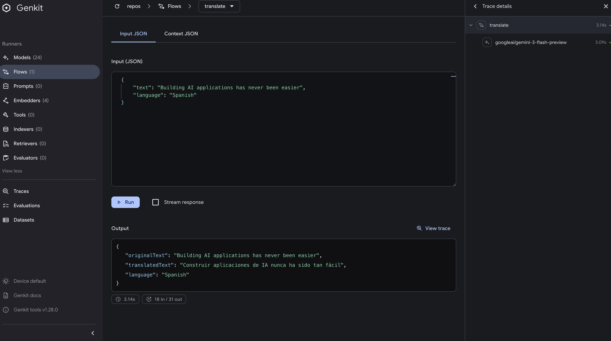

# It Has Never Been This Easy to Build Gen AI Features in Java

Building generative AI applications in Java used to be a complex, boilerplate-heavy endeavor. You'd wrestle with raw HTTP clients, hand-craft JSON payloads, parse streaming responses, manage API keys, and stitch together observability, all before writing a single line of actual AI logic. Those days are over.

**[Genkit Java](https://github.com/genkit-ai/genkit-java)** is an open-source framework that makes building AI-powered applications in Java as straightforward as defining a function. Pair it with **Google's Gemini** models and **Google Cloud Run**, and you can go from zero to a production-deployed generative AI service in minutes, not days.

This is a complete, working example. Clone it, set your API key, and run.

## Why Genkit Java?

If you're a Java developer, you've probably watched the Gen AI revolution unfold mostly in Python and TypeScript. The tooling, the frameworks, the tutorials, all skewed toward those ecosystems. Java developers were left to either build everything from scratch or use verbose, low-level SDKs.

Genkit Java changes that. Here's what makes it different:

| Feature | Without Genkit | With Genkit |
| Call Gemini | Manual HTTP client, JSON parsing, error handling | `genkit.generate(...)`, one method call |
| Expose as API | Set up Spring Boot, write controllers, handle serialization | `genkit.defineFlow(...)`, auto-exposed as HTTP endpoint |
| Structured output | Parse raw JSON strings, deserialize manually | `outputClass(MyClass.class)`, Gemini returns typed Java objects |
| Tool calling | Parse function call responses, execute tools, re-submit | Define tools with `genkit.defineTool(...)`, automatic execution |
| Observability | Manual OpenTelemetry setup, custom spans, metrics | Built-in tracing, metrics, and latency tracking, zero config |
| Dev/test your flows | cURL, Postman, write test harnesses | **Genkit Dev UI**, visual, interactive, built-in |

## What We're Building

A Java application with a translation AI flow powered by Gemini via Genkit, showcasing:

- **Typed flow inputs**, `TranslateRequest` class with `@JsonProperty` annotations as the flow input
- **Structured LLM output**, Gemini returns a `TranslateResponse` Java object directly (no manual JSON parsing)
- **Typed flow outputs**, The flow returns a fully typed `TranslateResponse` to the caller

All of this in **a single Java file + two model classes**. No Spring Boot. No annotations soup. No XML configuration. Just clean, readable, type-safe code.

## Prerequisites

- **Java 21+** ([Eclipse Temurin](https://adoptium.net/) recommended)
- **Maven 3.6+**
- **Node.js 18+** (for the Genkit CLI)
- A **Google GenAI API key** (free from [Google AI Studio](https://aistudio.google.com/))
- **Google Cloud SDK** (only for Cloud Run deployment)

### Install the Genkit CLI

The Genkit CLI is your command-line companion for developing and testing AI flows. Install it globally:

```bash
npm install -g genkit
```

Verify the installation:

```bash
genkit --version
```

The CLI is what powers the Dev UI and provides a seamless development experience, more on that below.

## Project Structure

```
genkit-java-getting-started/
├── src/
│   └── main/
│       ├── java/
│       │   └── com/example/
│       │       ├── App.java                # ← The main application
│       │       ├── TranslateRequest.java   # ← Typed flow input
│       │       └── TranslateResponse.java  # ← Typed flow + LLM output
│       └── resources/
│           └── logback.xml                 # Logging configuration
├── pom.xml                                 # Maven config with Genkit + Jib
├── run.sh                                  # Quick-start script
└── README.md                               # This article
```


## Getting Started

### 1. Clone and Set Your API Key

```bash
git clone https://github.com/xavidop/genkit-java-getting-started.git
cd genkit-java-getting-started

export GOOGLE_API_KEY=your-api-key-here
```

### 2. Run with the Genkit Dev UI (Recommended)

```bash
genkit start -- mvn compile exec:java
```

That's it. Two commands. Your AI-powered Java server is running on `http://localhost:8080`, and the **Genkit Dev UI** is available at `http://localhost:4000`.



### 3. Or Run Directly (Without Dev UI)

```bash
mvn compile exec:java
```

## The Code, It's Stupidly Simple

### Step 1: Define Typed Input/Output Classes

Instead of using raw `Map` or `String`, define proper Java classes with Jackson annotations. Genkit uses these annotations to generate JSON schemas that tell Gemini exactly what structure to return.

**`TranslateRequest.java`**, the flow input:

```java
import com.fasterxml.jackson.annotation.JsonProperty;
import com.fasterxml.jackson.annotation.JsonPropertyDescription;

/**
 * Input for the translate flow.
 */
public class TranslateRequest {

    @JsonProperty(required = true)
    @JsonPropertyDescription("The text to translate")
    private String text;

    @JsonProperty(required = true)
    @JsonPropertyDescription("The target language (e.g., Spanish, French, Japanese)")
    private String language;

    public TranslateRequest() {}

    public TranslateRequest(String text, String language) {
        this.text = text;
        this.language = language;
    }

    public String getText() {
        return text;
    }

    public void setText(String text) {
        this.text = text;
    }

    public String getLanguage() {
        return language;
    }

    public void setLanguage(String language) {
        this.language = language;
    }

    @Override
    public String toString() {
        return String.format("TranslateRequest{text='%s', language='%s'}", text, language);
    }
}
```

**`TranslateResponse.java`**, the flow output *and* the LLM structured output:

```java
import com.fasterxml.jackson.annotation.JsonProperty;
import com.fasterxml.jackson.annotation.JsonPropertyDescription;

/**
 * Structured output for the translate flow.
 */
public class TranslateResponse {

    @JsonProperty(required = true)
    @JsonPropertyDescription("The original text that was translated")
    private String originalText;

    @JsonProperty(required = true)
    @JsonPropertyDescription("The translated text")
    private String translatedText;

    @JsonProperty(required = true)
    @JsonPropertyDescription("The target language")
    private String language;

    public TranslateResponse() {}

    public TranslateResponse(String originalText, String translatedText, String language) {
        this.originalText = originalText;
        this.translatedText = translatedText;
        this.language = language;
    }

    public String getOriginalText() {
        return originalText;
    }

    public void setOriginalText(String originalText) {
        this.originalText = originalText;
    }

    public String getTranslatedText() {
        return translatedText;
    }

    public void setTranslatedText(String translatedText) {
        this.translatedText = translatedText;
    }

    public String getLanguage() {
        return language;
    }

    public void setLanguage(String language) {
        this.language = language;
    }

    @Override
    public String toString() {
        return String.format(
            "TranslateResponse{originalText='%s', translatedText='%s', language='%s'}",
            originalText, translatedText, language);
    }
}
```

The `@JsonPropertyDescription` annotations are key, Genkit passes them to Gemini as part of the JSON schema, so the model knows exactly what each field means.

### Step 2: Initialize Genkit

```java
Genkit genkit = Genkit.builder()
    .options(GenkitOptions.builder()
        .devMode(true)
        .reflectionPort(3100)
        .build())
    .plugin(GoogleGenAIPlugin.create())
    .plugin(jetty)
    .build();
```

That's the entire setup. The `GoogleGenAIPlugin` reads your `GOOGLE_API_KEY` automatically. The `JettyPlugin` handles HTTP. Genkit wires everything together.

### Step 3: Define a Flow with Typed Classes and Structured Output

```java
genkit.defineFlow(
    "translate",
    TranslateRequest.class,     // ← typed input
    TranslateResponse.class,    // ← typed output
    (ctx, request) -> {
        String prompt = String.format(
            "Translate the following text to %s.\n\nText: %s",
            request.getLanguage(), request.getText()
        );

        return genkit.generate(
            GenerateOptions.<TranslateResponse>builder()
                .model("googleai/gemini-3-flash-preview")
                .prompt(prompt)
                .outputClass(TranslateResponse.class)  // ← Gemini returns a typed object!
                .config(GenerationConfig.builder()
                    .temperature(0.1)
                    .build())
                .build()
        );
    }
);
```

Look at what's happening here:

1. **`TranslateRequest.class`** as the flow input, Genkit automatically deserializes incoming JSON into a `TranslateRequest` object. No `Map.get()` casting.
2. **`TranslateResponse.class`** as the flow output, the flow returns a typed object, serialized automatically to JSON for the HTTP response.
3. **`outputClass(TranslateResponse.class)`** on the `generate` call, this is the magic. Genkit sends the JSON schema derived from `TranslateResponse` to Gemini, and Gemini returns structured JSON that Genkit deserializes into a `TranslateResponse` object. No `response.getText()` + manual parsing.

That single `defineFlow` call:
- Registers the flow in Genkit's internal registry
- Exposes it as a `POST /api/flows/translate` HTTP endpoint
- Makes it visible in the Dev UI
- Adds full OpenTelemetry tracing automatically
- Tracks token usage, latency, and error rates

Compare that to writing a Spring Boot controller + service + DTO + config + exception handler for the same functionality.


## The Genkit Dev UI - Your AI Playground

This is where Genkit truly shines for development. When you run with `genkit start`, the CLI launches a **visual Dev UI** at `http://localhost:4000`.

### What Can You Do in the Dev UI?

- **Browse all flows**, See every flow you've registered, like `translate`, with its typed input/output schemas.
- **Run flows interactively**, Fill in a `TranslateRequest` JSON, click "Run", see the `TranslateResponse` instantly. No cURL needed.
- **Inspect traces**, Every flow execution is traced. See exactly which model was called, what the input/output was, how long it took, and how many tokens were used.
- **View registered models & tools**, See all available Gemini models and any tools you've defined.
- **Test tool calling**, Watch Gemini decide to call your tools in real-time.
- **Manage datasets & evaluations**, Create test datasets and evaluate your AI outputs.

## Deploying to Google Cloud Run

The project uses **[Jib](https://github.com/GoogleContainerTools/jib)** to build and push container images directly from Maven, **no Dockerfile and no Docker daemon required**. Jib is configured in the `pom.xml` and builds optimized, layered container images.

### Step-by-Step Deployment

```bash
# Set your GCP project
export PROJECT_ID=$(gcloud config get-value project)
export REGION=us-central1

# Build the container image and push it to Google Container Registry
# No Docker needed, Jib does it all from Maven!
mvn compile jib:build -Djib.to.image=gcr.io/$PROJECT_ID/genkit-java-app

# Deploy to Cloud Run
gcloud run deploy genkit-java-app \
  --image gcr.io/$PROJECT_ID/genkit-java-app \
  --region $REGION \
  --platform managed \
  --allow-unauthenticated \
  --set-env-vars "GOOGLE_API_KEY=$GOOGLE_API_KEY" \
  --memory 512Mi \
  --cpu 1
```

Two commands. No Docker. Your Java GenAI application is now live on a globally-distributed, auto-scaling, serverless platform.

### Why Jib?

- **No Dockerfile**, Container image is built directly from your Maven project
- **No Docker daemon**, Doesn't require Docker installed or running on your machine
- **Fast rebuilds**, Separates dependencies, classes, and resources into layers, so only changed layers are rebuilt
- **Reproducible**, Builds are deterministic and don't depend on the local Docker environment
- **Direct push**, Sends the image straight to GCR/Artifact Registry without a local `docker push`

You can also build a local Docker image (requires Docker running) with:

```bash
mvn compile jib:dockerBuild -Djib.to.image=genkit-java-app
```

## Available Flows & API Examples

Once the server is running, test the translate flow:

### Translate Text

Send a `TranslateRequest` JSON object and receive a structured `TranslateResponse`:

```bash
curl -X POST http://localhost:8080/api/flows/translate \
  -H 'Content-Type: application/json' \
  -d '{"text": "Building AI applications has never been easier", "language": "Spanish"}'
```

Example response (a `TranslateResponse` object):

```json
{
  "originalText": "Building AI applications has never been easier",
  "translatedText": "Construir aplicaciones de IA nunca ha sido tan fácil",
  "language": "Spanish"
}
```

Try other languages:

```bash
# French
curl -X POST http://localhost:8080/api/flows/translate \
  -H 'Content-Type: application/json' \
  -d '{"text": "Genkit makes Java AI development simple", "language": "French"}'

# Japanese
curl -X POST http://localhost:8080/api/flows/translate \
  -H 'Content-Type: application/json' \
  -d '{"text": "Hello world", "language": "Japanese"}'
```

Notice how the response is always a structured JSON object, not a raw string. That's the power of `outputClass(TranslateResponse.class)`. Gemini returns structured data that Genkit deserializes into your Java class automatically.

## What Genkit Gives You for Free

When you use Genkit, you're not just getting a wrapper around API calls. You get a production-grade framework:

### Observability (Zero Config)

Every flow execution is automatically traced with OpenTelemetry:
- **Latency tracking** per flow, per model call
- **Token usage** (input/output/thinking tokens)
- **Error rates** and failure tracking
- **Span hierarchy** showing the full execution path

### Plugin Ecosystem

Need to swap Gemini for another model? Change one line:

```java
// Switch from Gemini to OpenAI
.plugin(OpenAIPlugin.create())

// Or use Anthropic Claude
.plugin(AnthropicPlugin.create())

// Or run locally with Ollama
.plugin(OllamaPlugin.create())
```

Genkit supports 10+ model providers, vector databases (Pinecone, Weaviate, PostgreSQL), Firebase integration, and more.

### Type Safety

This is where Genkit really shines for Java developers. Flows, generate calls, and even LLM responses are fully typed:

```java
// The flow takes a TranslateRequest and returns a TranslateResponse
genkit.defineFlow("translate", TranslateRequest.class, TranslateResponse.class, ...);

// The LLM returns a TranslateResponse directly, no string parsing
genkit.generate(
    GenerateOptions.<TranslateResponse>builder()
        .outputClass(TranslateResponse.class)
        .build()
);
```

Genkit derives JSON schemas from your `@JsonProperty` and `@JsonPropertyDescription` annotations and sends them to Gemini, so the model returns structured data that maps directly to your Java classes. No `Object` casting, no `response.getText()` + `objectMapper.readValue()`, no runtime surprises.

## What's Next?

This getting-started project covers the fundamentals. Genkit Java can do much more:

- **RAG**, Retrieval-Augmented Generation with vector stores (Firestore, Pinecone, pgvector, Weaviate)
- **Multi-agent orchestration**, Coordinate multiple AI agents
- **Chat sessions**, Multi-turn conversations with session persistence
- **Evaluations**, RAGAS-style metrics to measure your AI output quality
- **MCP Integration**, Connect to Model Context Protocol servers
- **Spring Boot**, Use the Spring plugin instead of Jetty for existing Spring apps
- **Firebase**, Deploy as Cloud Functions with Firestore vector search

Explore the [full Genkit Java documentation](https://github.com/genkit-ai/genkit-java) and the [samples directory](https://github.com/genkit-ai/genkit-java/tree/main/samples) to dive deeper.

## License

Apache License 2.0
